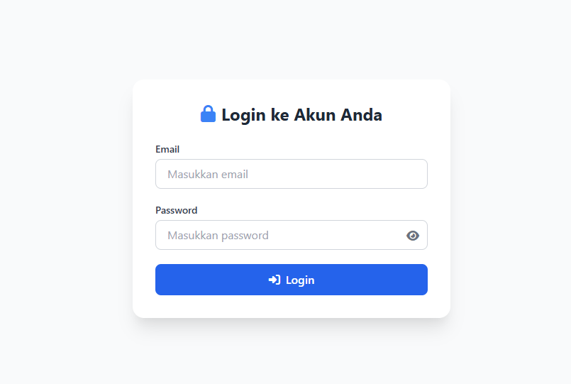
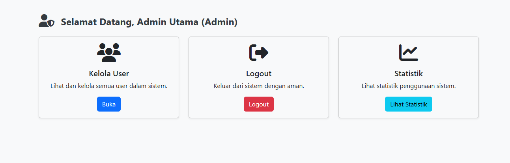
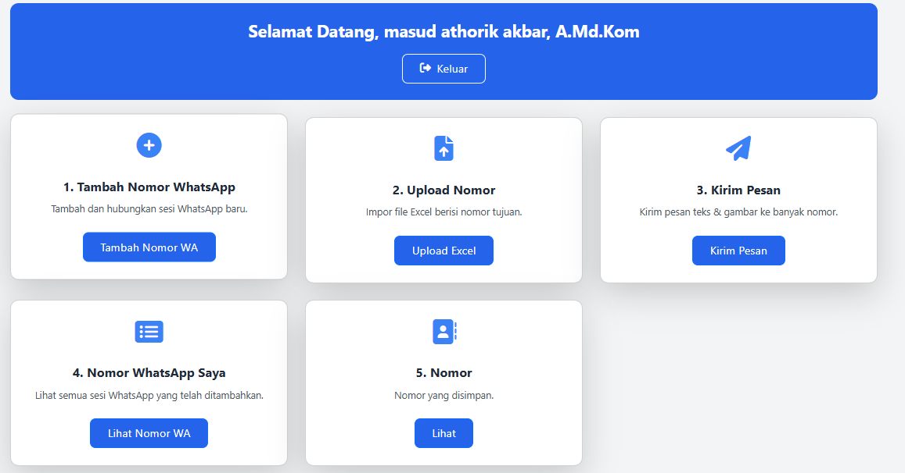
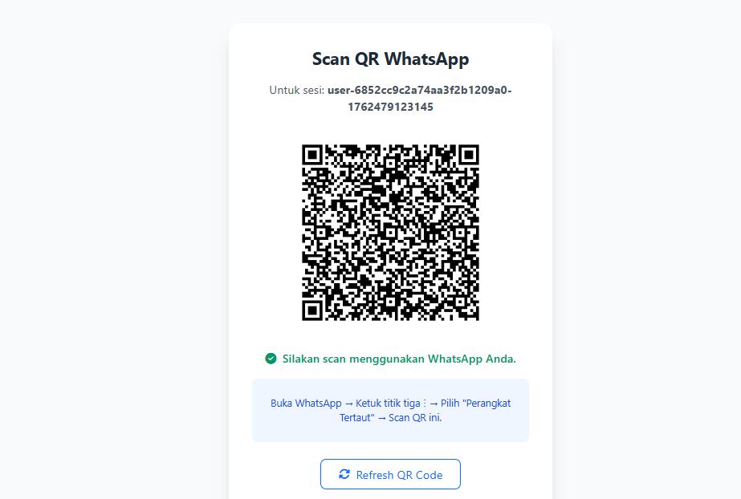
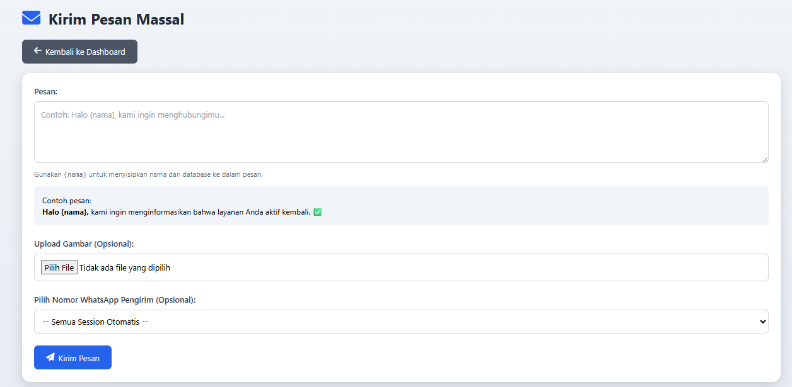
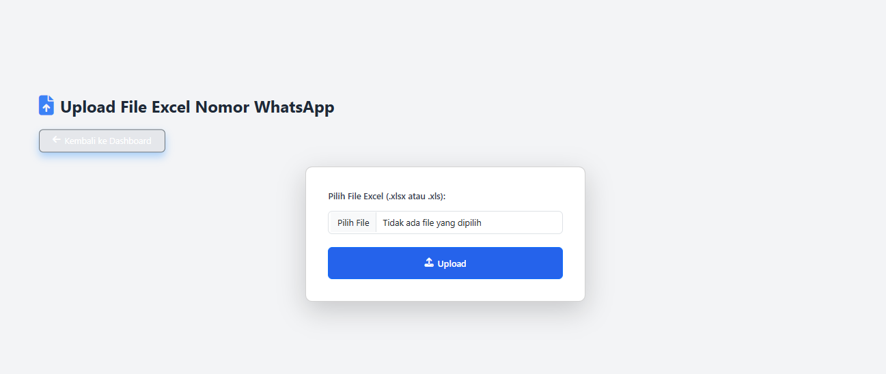
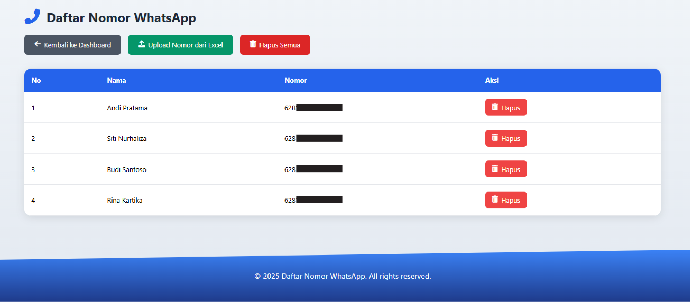

# 📢 Broadcast Message Node.js

Aplikasi **Broadcast Message** ini dibuat menggunakan **Node.js**.  
Fungsinya untuk mengirim pesan WhatsApp secara massal dengan mudah dan efisien.

---

## 🚀 Fitur Utama
- Kirim pesan WhatsApp ke banyak kontak sekaligus.  
- Integrasi dengan **whatsapp-web.js**.  
- Simpan sesi login agar tidak perlu scan QR berulang kali.  
- Tampilan web sederhana dan mudah digunakan.  
- Dapat mengirim teks dan gambar.  

---

## 🛠️ Teknologi yang Digunakan
- **Node.js**
- **Express.js**
- **whatsapp-web.js**
- **Bootstrap / Tailwind CSS (opsional)**
- **Multer** untuk upload file
- **dotenv** untuk konfigurasi lingkungan

---

## 📸 Tampilan Aplikasi
Berikut beberapa cuplikan tampilan aplikasi:

| Tampilan | Gambar |
|-----------|--------|
| Dashboard Utama |  |
| Scan QR WhatsApp |  |
| Halaman Broadcast |  |
| Kirim Pesan Sukses |  |
| Daftar Pesan |  |
| Log Aktivitas |  |
| Pengaturan |  |

> Semua gambar berada di folder utama proyek (`1.jpg` s.d. `7.jpg`).

---

## ⚙️ Cara Menjalankan Aplikasi
1. Clone repositori ini:
   ```bash
   git clone https://github.com/masudathariq/broadcast-masssage-nodejs.git
